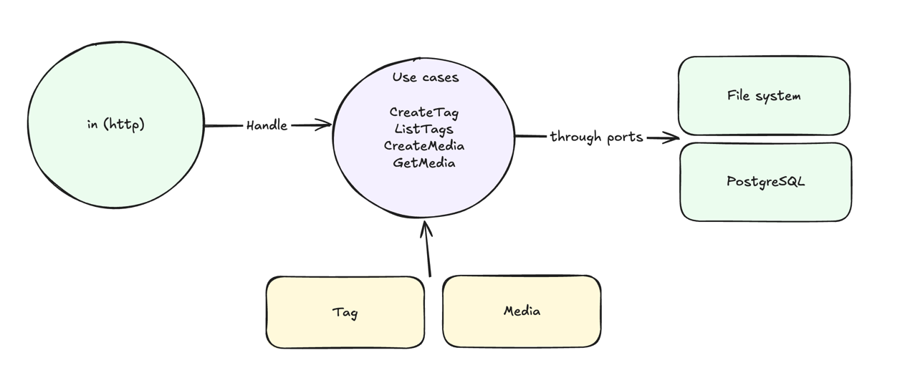

# scoreplay-media-api

Design rationale, trade-offs and what I left out is in [DESIGN.md](DESIGN.md).

## Requirements

- Docker (with Compose) 
- Go 1.25 to run the tests locally

## Quickstart

```bash
docker compose up --build -d
curl -fsS localhost:8080/readyz
```

This will start the database (PostgreSQL), apply the migrations needed and then start the API on `:8080`. 

```bash
docker compose down -v      # stops everything 
docker compose logs -f api  # follow the JSON logs
```

## API

Base URL `http://localhost:8080`. All responses are JSON.

| Method | Path | Success | Errors |
|---|---|---|---|
| `POST` | `/tags` | `201` `{id,name}` | `400` invalid name · `409` duplicate |
| `GET` | `/tags` | `200` `[{id,name}]` | – |
| `POST` | `/media` | `201` + `Location` + `{id,name,tags,fileUrl}` | `400` · `413` too large · `415` unsupported type |
| `GET` | `/media/{id}` | `200` `{id,name,tags,fileUrl}` | `400` malformed id · `404` unknown id |
| `GET` | `/healthz` | `200` liveness, no dependencies | – |
| `GET` | `/readyz` | `200` + dependency status | `503` a dependency is unreachable |

### Create a tag

```bash
curl -sS -XPOST localhost:8080/tags \
  -H 'content-type: application/json' \
  -d '{"name":"Messi"}'
```

```json
{"id":"01a013a1-3d04-74c6-a7f9-e287dec5f6a5","name":"Messi"}
```

Tag names are unique and case-insensitively: `messi` after `Messi` will return a `409` error.

### List tags

```bash
curl -sS localhost:8080/tags
```

```json
[{"id":"01a013a1-3d04-74c6-a7f9-e287dec5f6a5","name":"Messi"}]
```

Ordered by `lower(name)`. An empty list serialises as `[]`.

### Upload a media

`multipart/form-data` with three parts: `name`, `file`, and `tags` — repeated once per tag id.

```bash
curl -sS -XPOST localhost:8080/media \
  -F 'name=Messi free kick' \
  -F 'tags=01a013a1-3d04-74c6-a7f9-e287dec5f6a5' \
  -F 'file=@testdata/sample.jpg'
```

```json
{
  "id": "01a013a1-3d2f-73b9-a657-707fffa4f189",
  "name": "Messi free kick",
  "tags": ["Messi"],
  "fileUrl": "http://localhost:8080/files/01a013a1-3d2f-73b9-a657-707fffa4f189"
}
```

> ⚠️ When creating media, tag ids should be used instead of tag names. `tags` may be omitted
. If the provided tag id does not exist the API will throw `400` naming it, and nothing is written:

```json
{"error":{"code":"unknown_tags","message":"unknown tag ids: 0000…0000",
          "details":{"unknown_tag_ids":["00000000-0000-0000-0000-000000000000"]}}}
```


### Retrieve media

```bash
curl -sS localhost:8080/media/01a013a1-3d2f-73b9-a657-707fffa4f189
```

Same body as the upload response.

`fileUrl` is the address the object will have; **this service does not serve the bytes**, so
`GET <fileUrl>` answers `404` today. I decided to leave this out of the scope of this project as it wouldn't give too much value.

### Errors

Every error uses the same envelope, with `details` present only where it adds something:

```json
{"error":{"code":"validation_error","message":"invalid name: must not be empty",
          "details":{"field":"name"}}}
```

Codes: `validation_error` · `unknown_tags` · `unsupported_media_type` · `conflict` ·
`not_found` · `payload_too_large` · `invalid_body` · `missing_file` · `internal_error`.
Internal failures return a generic message; the real error is logged server-side.

## Configuration

Everything is read from the environment at boot, prefixed `SCOREPLAY_`. Compose sets these for
you; the defaults are what a bare `make run` uses.

| Variable | Default | Notes |
|---|---|---|
| `SCOREPLAY_DATABASE_URL` | *(required)* | Full DSN — pgx, Compose and `golang-migrate` all take this form |
| `SCOREPLAY_SERVER_PORT` | `8080` | |
| `SCOREPLAY_SERVER_BASE_URL` | `http://localhost:8080` | Prefix of the `fileUrl` returned to clients |
| `SCOREPLAY_STORAGE_ROOT` | `./data/media` | Where uploads land. Compose mounts a volume at `/data/media` |
| `SCOREPLAY_STORAGE_MAX_UPLOAD_BYTES` | `268435456` (256 MiB) | Larger bodies are cut off with a `413`. Compose raises it to 512 MiB |
| `SCOREPLAY_LOG_LEVEL` | `info` | `debug` · `info` · `warn` · `error` |
| `SCOREPLAY_SHUTDOWN_TIMEOUT` | `10s` | Grace period for in-flight requests on `SIGTERM` |

## Tests

```bash
make test               # unit tests, race detector, no infrastructure needed
make test-integration   # adds the Postgres suite, needs Docker
make cover              # coverage report in the browser
make lint               # go vet + golangci-lint
```

Two layers, split by what they need:

- **Unit tests** cover the domain entities, the use cases, and the HTTP handlers.
- **Integration tests** they test the real repositories
  against a PostgreSQL container started by [testcontainers](https://testcontainers.com/),
  with the needed migrations in `migrations/` applied. 

## Project structure

I have decided to follow hexagonal architecture with three layers:
* domain: here we should only have pure domain logic. Functions that receive, validate and transform data according to our domain rules
  * ports: interfaces definitions
* application: use cases are defined here. In charge of orchestrating domain and infra
* infrastructure: entrypoints of the application and data representations (databases)
  * adapters: implementations of the ports from the domain layer



```
cmd/api/main.go              config → wiring → serve → graceful shutdown
internal/
  domain/                    entities and their rules, errors and ports definitions
    tag.go  media.go         
    errors.go                
    ports/                   
  application/               one file per use case, each a Handle(ctx, cmd)
  infra/
    in/http/                 chi router, transport handlers, DTOs, domain error → status mapping
    out/postgres/            pgx repositories
    out/storage/             LocalFileStore, the FileStore port on the local filesystem
  platform/                  cross-cutting technical concerns, not adapters: config, logging
migrations/                  golang-migrate files
```
